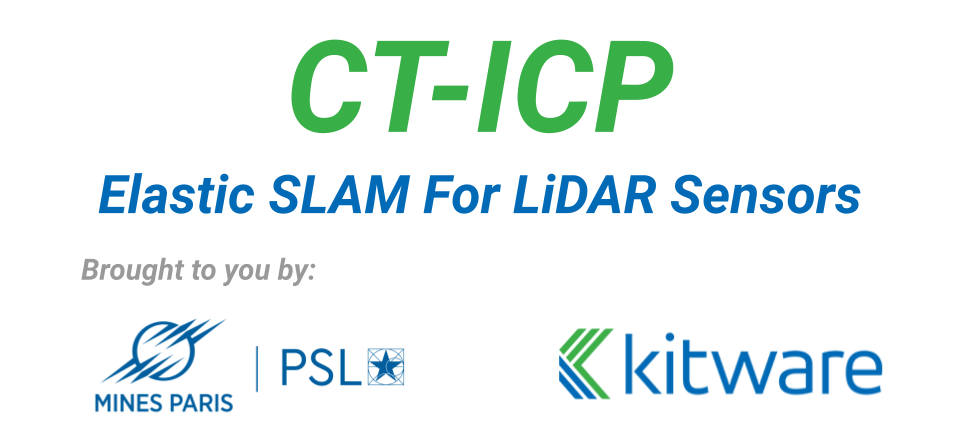

This repository implements the SLAM **CT-ICP** (see  [our article](https://arxiv.org/abs/2109.12979)), a lightweight,
precise and versatile pure LiDAR odometry.

The code can be run with **ROS**, but also as an independent library, or using scripts we provide.

It is integrated with the python project **[pyLiDAR-SLAM](https://github.com/Kitware/pyLiDAR-SLAM)** which gives access
to more datasets.
**pyLiDAR-SLAM** requires the installation of the python binding for **CT-ICP** (see below).


## NEWS:

##### [27/07/2022] New release, with increased ROS support

> We introduce a new release, with significant changes in the code. We do not guarantee the results of the article in
> this branch, (though this branch should globally our SLAM). To replicate the results from the dataset, see the
> release `ICRA-2022`
>

# Installation

### Requirements

> Compiler: GCC >= 7.5, clang >= 8.01
>
> cmake >= 3.14

##### Tested On:

| OS    | COMPILER       |
| --- |----------------|
| Ubuntu 18.04 | GCC >= 7.5     |
| Ubuntu 18.04 | clang >= 8.01  | 

### Step 0: Clone the directory

```bash
git clone https://github.com/jedeschaud/ct_icp.git
cd ct_icp
```

### Step 1: Superbuild

> CT-ICP uses **Kitware**'s [**
Superbuild**](https://gitlab.kitware.com/keu-computervision/MappingResearchKEU/Superbuild) to build the external
> dependencies.
>
> You can either install the external dependencies, or use the script below to install all dependencies:

```bash
mkdir .cmake-build-superbuild && cd .cmake-build-superbuild     #< Creates the cmake folder
cmake ../superbuild                                             #< (1) Configure step 
cmake --build . --config Release                                #< Build step (Downloads and install the dependencies)
```

> If everything worked, a directory `install` should have been created with at its root a `superbuild_import.cmake`
> file.

### Step 2: Build and install CT-ICP library

```bash
# Inside the main directory
mkdir cmake-build-release && cd  cmake-build-release                  #< Create the build directory
cmake .. -DCMAKE_BUILD_TYPE=Release                                   #< (2) Configure with the desired options (specify arguments with -D<arg_name>=<arg_value>)
cmake --build . --target install --config Release --parallel 12       #< Build and Install the project
```

> If everything worked fine, a `CT_ICP` subdirectory should appear in your **Superbuild Directory**.
> You can use the config files located at `<SUPERBUILD_INSTALL_DIR>/CT_ICP/lib/cmake` to load the libraries in a cmake
> project, or use ROS or the specified executables.

### Step 3: ROS

To build the ROS wrapping for **CT-ICP**, first build and install the CT-ICP library (see *Steps 1 and 2* ).

> /!\ Set the CMAKE argument `-DWITH_ROS=ON` to the configure step (1) of the superbuild (*Step 1*)
>

Install the `ROSCore` library, (this should install a shared library named `ROSCore`
at `<CT_ICP_INSTALL_DIR>/CT_ICP/lib`):

```bash
cd ros/roscore
mkdir cmake-build-release && cd  cmake-build-release                  #< Create the build directory
cmake .. -DCMAKE_BUILD_TYPE=Release                                   #< (2) Configure with the desired options (specify arguments with -D<arg_name>=<arg_value>)
cmake --build . --target install --config Release --parallel 12       #< Build and Install the ROSCore library
```

> Then make a symbolic link of the directory `ct_icp_odometry` and `slam_roscore` of this project to the `src` directory
> of your catkin
> workspace.

```bash
cd <path-to-your-catkin-workspace>/src                              #< Move to the Catkin Workspace's src directory
ln -s <path-to-ct_icp-git-project>/ros/catkin_ws/ct_icp_odometry ct_icp_odometry        #< Make a symbolic link to the `catkin_ws` folder
ln -s <path-to-ct_icp-git-project>/ros/catkin_ws/slam_roscore slam_roscore        #< Make a symbolic link to the `catkin_ws` folder
cd ..                                                               #< Move back to the root of the catkin workspace
catkin_make -DSUPERBUILD_INSTALL_DIR=<path-to-superbuild-install-dir>
```

> If the installation is successful, and after sourcing the workspace's devel directory, you should be able to launch
> the ROS Nodes installed.

> The wrapping defines the following nodes:

- `ct_icp_dataset_node`: A node which publishes pointclouds of ct_icp's different datasets read from disk.
- `ct_icp_odometry_node`: The main odometry node running `ct_icp`'s odometry.

```
roslaunch ct_icp_odometry launch_slam_dataset.launch dataset_path:=<path-to-dataset-root> dataset:=<dataset_name> sequence:=<sequence_name>
```

[//]: # (### Visualization [experimental])

[//]: # ()

[//]: # (> As a debugging/visualization tool we use a home-made/experimental lightweight OpenGL-based pointcloud visualizer **[viz3d]&#40;https://github.com/pierdell/viz3d&#41;** designed for our SLAM use case.)

[//]: # (> )

[//]: # (> To activate pass the argument `-DWITH_VIZ3D=ON` to the configure steps of the `Superbuild &#40;1&#41;`, `CT_ICP &#40;2&#41;` )

# Install the Datasets

### CT-ICP Datasets from the article

The Datasets are publicly available at:
https://cloud.mines-paristech.fr/index.php/s/UwgVFtiTOmrgKp5

The folder is protected by the following password : **npm3d**

Each dataset is a .zip archive containing the PLY scan file with the relative timestamps for each point in the frame,
and if available, the ground truth poses.

To install each dataset, simply download and extract the archives on disk. The datasets are redistributions of existing
and copyrighted datasets, we only offer a convenient repackaging of these datasets.

The dataset available are the following:

**Under Creative Commons Attribution-NonCommercial-ShareAlike LICENCE**

- *KITTI* (see [eval_odometry.php](http://www.cvlibs.net/datasets/kitti/eval_odometry.php)):
    - The most popular benchmark for odometry evaluation.
    - The sensor is a Velodyne HDL-64
    - The frames are motion-compensated (no relative-timestamps) and the Continuous-Time aspect of CT-ICP will not work
      on this dataset.
    - Contains 21 sequences for ~40k frames (11 with ground truth)
- *KITTI_raw* (see [eval_odometry.php](http://www.cvlibs.net/datasets/kitti/eval_odometry.php)): :
    - The same dataset as *KITTI* without the motion-compensation, thus with meaningful timestamps.
    - The raw data for sequence `03` is not available
- *KITTI_360* (see [KITTI-360](http://www.cvlibs.net/datasets/kitti-360/)):
    - The successor of *KITTI*, contains longer sequences with timestamped point clouds.
    - The sensor is also a Velodyne HDL-64

**Permissive LICENSE**

- *NCLT*: (see [nclt](http://robots.engin.umich.edu/nclt/))
    - Velodyne HDL-32 mounted on a segway
    - 27 long sequences (up to in the campus of MICHIGAN university over a long
    - Challenging motions (abrupt orientation changes)
    - **NOTE**: For this dataset, directly download the *Velodyne* links (
      e.g. [2012-01-08_vel.tar](http://robots.engin.umich.edu/nclt/velodyne_data/2012-01-08_vel.tar.gz)). Our code
      directly reads the *velodyne_hits.bin* file.
- *KITTI-CARLA*: (see and cite [KITTI-CARLA](https://arxiv.org/abs/2109.00892)):
    - 7 sequences of 5000 frames generated using the [CARLA](https://carla.readthedocs.io/en/0.9.10/) simulator
    - Imitates the KITTI sensor configuration (64 channel rotating LiDAR)
    - Simulated motion with very abrupt rotations
- *ParisLuco* (published with our work **CT-ICP**, cf below to cite us):
    - A single sequence taken around the Luxembourg Garden
    - HDL-32, with numerous dynamic objects

### Download ROSBAGS to run the SLAM with ROS

Below we give a list of datasets for we worked on the ROSBags,
and for which we propose a roslaunch file.

- [UrbanLoco](https://github.com/weisongwen/UrbanLoco): A Road Dataset for localization in Urban Scenes
- [HILTI](https://hilti-challenge.com/index.html): A benchmark for precision mapping in construction sites
- [SubT](https://bitbucket.org/subtchallenge/subt_reference_datasets/src/master/): Subterrean datasets acquired in the
  context of DARPA Subterrean Challenge bu the Army Research Laboratory
- [SubT](https://bitbucket.org/subtchallenge/subt_reference_datasets/src/master/): Subterrean datasets acquired in the
  context of DARPA Subterrean Challenge bu the Army Research Laboratory
- [Newer College Dataset](https://ori-drs.github.io/newer-college-dataset/): A large dataset of handheld sensors
  acquired by the Oxford

For more datasets, don't hesitate to look at this awesome
list [List of SLAM Datasets](https://github.com/youngguncho/awesome-slam-datasets#mapping()).

## Running the SLAM

### OPTION I -- Using the scripts (on the *ct-icp* datasets)

If the installation of CT-ICP went fine, there should be an executable located
at `<CT_ICP_INSTALL_DIR>/bin/run_odometry`.
This executable can be run with a config file with the command:

```./run_odometry -c <path-to-config-file>```

See `./config/odometry/driving_config.yaml` for an example of the format of the config file to expect.

If `CT-ICP` was installed with `viz3d`, the SLAM should run along a GUI, otherwise, the trajectory and metrics will be
saved to disk regularly.

### OPTION II -- Using the SLAM as a library

After the installation, you can also use `CT_ICP` and `SlamCore` libraries, located in `<CT_ICP_INSTALL_DIR>/lib`,
for instance with a cmake project with the cmake config files for the libraries located
at `<CT_ICP_INSTALL_DIR>/lib/cmake`.

See for example `command/cmd_run_odometry.cpp` and `command/odometry_runner.h` for an example of use.

#### Custom Datasets

Some datasets are defined in the library (with expected layout for the Data, see `dataset.h, dataset.cpp`), but you can
extend
`ct_icp::ADatasetSequence` to define your own custom datasets.

### OPTION III -- Using ROS

After completing the ROS installation, use the launch files defined in `ros/catkin_ws/ct_icp_odometry/launch` on a
rosbag to launch the odometry, for e.g:

```
roslaunch ct_icp_odometry urban_loco_CAL.launch rosbag:=<path-to-UrbanLoco-root>/CA-20190828190411_blur_align.bag
```

## Citation

If you use our work in your research project, please consider citing:

```
@misc{dellenbach2021cticp,
  title={CT-ICP: Real-time Elastic LiDAR Odometry with Loop Closure},
  author={Pierre Dellenbach and Jean-Emmanuel Deschaud and Bastien Jacquet and François Goulette},
  year={2021},
  eprint={2109.12979},
  archivePrefix={arXiv},
  primaryClass={cs.RO}
}
```

## TODO(s)

- [x] Write ROS packaging v.0.1
- [x] Update the Readme.md
- [x] Add integration / performance tests on synthetic data
- [ ] Improve the ROS packaging to be more robust in real time to more datasets
- [ ] Fix the binding (which is now broken)
- [ ] Add tests/automatic build to the Github CI

- [ ] Add a wiki (documentation on the code)
